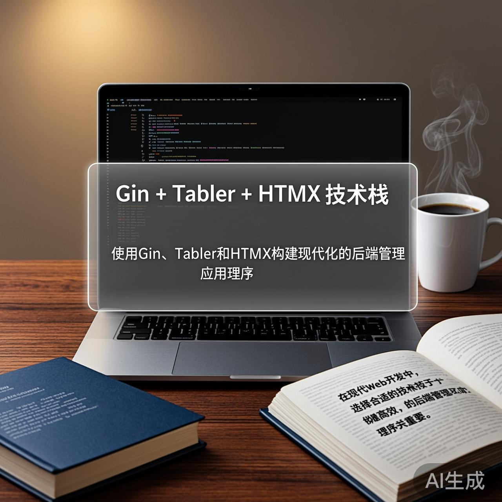
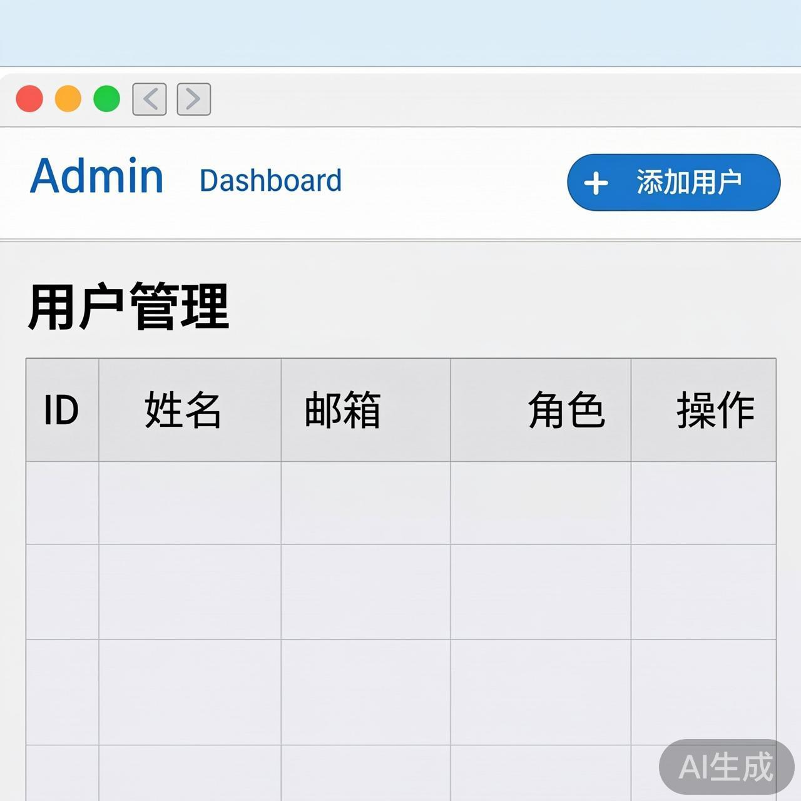

在现代Web开发中，选择合适的技术栈对于构建高效、可维护的后端管理应用程序至关重要。本文将介绍如何结合使用 **Gin**（Go语言的高性能Web框架）、**Tabler**（一个现代的响应式前端UI框架）和 **HTMX**（一个让HTML拥有类似AJAX能力的库）来构建一个功能丰富、交互流畅的后端管理应用。

## 技术栈介绍

### 1. Gin - 高性能Go Web框架

Gin是一个用Go编写的Web框架，具有高性能和丰富的功能。它提供了路由、中间件、参数解析等核心功能，非常适合构建RESTful API和Web应用。

### 2. Tabler - 现代化前端UI框架

Tabler是一个基于Bootstrap的开源前端框架，提供了丰富的组件和现代化的设计风格，适合构建管理后台界面。

### 3. HTMX - 轻量级前端交互库

HTMX允许你在HTML中直接使用现代浏览器功能，如AJAX、WebSockets等，而无需编写JavaScript。它让HTML变得"有超能力"。

## 项目架构

我们的应用将采用前后端分离的架构：

```
backend/ (Gin API服务)
├── main.go          # 应用入口
├── router.go        # 路由定义
├── handlers/        # 处理器函数
├── models/          # 数据模型
└── templates/       # HTML模板

frontend/ (Tabler + HTMX)
├── index.html       # 主页面
├── dashboard.html   # 仪表盘
└── components/      # 可复用组件
```

## 实现步骤

### 第一步：设置Gin后端

首先，我们需要创建一个基本的Gin应用：

```go
// main.go
package main

import (
    "github.com/gin-gonic/gin"
    "net/http"
)

func main() {
    router := gin.Default()
    
    // 静态文件服务
    router.Static("/static", "./static")
    router.StaticFile("/favicon.ico", "./static/favicon.ico")
    
    // API路由
    api := router.Group("/api")
    {
        api.GET("/users", getUsers)
        api.POST("/users", createUser)
        api.PUT("/users/:id", updateUser)
        api.DELETE("/users/:id", deleteUser)
    }
    
    // HTML路由
    router.GET("/", func(c *gin.Context) {
        c.File("./templates/index.html")
    })
    
    router.Run(":8080")
}

// 用户处理器函数示例
func getUsers(c *gin.Context) {
    // 实现获取用户列表逻辑
    c.JSON(http.StatusOK, gin.H{
        "status": "success",
        "data": []string{"user1", "user2", "user3"},
    })
}
```

### 第二步：创建Tabler前端界面

使用Tabler创建一个现代化的管理界面：

```html
<!-- templates/index.html -->
<!DOCTYPE html>
<html lang="zh-CN">
<head>
    <meta charset="UTF-8">
    <meta name="viewport" content="width=device-width, initial-scale=1.0">
    <title>管理后台</title>
    <link rel="stylesheet" href="https://cdn.jsdelivr.net/npm/tabler-icons@latest/iconfont/tabler-icons.min.css">
    <link rel="stylesheet" href="https://cdn.jsdelivr.net/npm/@tabler/core@latest/dist/css/tabler.min.css">
    <script src="https://cdn.jsdelivr.net/npm/htmx.org@latest/dist/htmx.min.js"></script>
</head>
<body>
    <div class="page">
        <!-- 顶部导航栏 -->
        <header class="navbar navbar-expand-md navbar-light d-print-none">
            <div class="container-xl">
                <button class="navbar-toggler" type="button" data-bs-toggle="collapse" data-bs-target="#navbar-menu">
                    <span class="navbar-toggler-icon"></span>
                </button>
                <h1 class="navbar-brand navbar-brand-autodark d-none-navbar-horizontal">
                    <span class="text-primary">Admin</span> Dashboard
                </h1>
            </div>
        </header>

        <!-- 主要内容区域 -->
        <div class="content">
            <div class="container-xl">
                <div class="page-header">
                    <div class="row align-items-center">
                        <div class="col">
                            <h2 class="page-title">用户管理</h2>
                        </div>
                        <div class="col-auto">
                            <button class="btn btn-primary" hx-post="/api/users" hx-target="#user-list" hx-swap="outerHTML">
                                <i class="ti ti-plus"></i> 添加用户
                            </button>
                        </div>
                    </div>
                </div>

                <!-- 用户列表 -->
                <div id="user-list" class="card">
                    <div class="card-body">
                        <table class="table table-vcenter card-table">
                            <thead>
                                <tr>
                                    <th>ID</th>
                                    <th>姓名</th>
                                    <th>邮箱</th>
                                    <th>角色</th>
                                    <th>操作</th>
                                </tr>
                            </thead>
                            <tbody>
                                <!-- 用户数据将通过HTMX动态加载 -->
                            </tbody>
                        </table>
                    </div>
                </div>
            </div>
        </div>
    </div>
</body>
</html>
```

### 第三步：实现HTMX交互

使用HTMX实现动态数据加载和交互：

```html
<!-- 用户列表动态加载 -->
<tbody hx-get="/api/users" hx-trigger="load" hx-target="this" hx-swap="innerHTML">
    <!-- 用户数据将在这里动态插入 -->
</tbody>

<!-- 添加用户表单 -->
<div id="add-user-form" class="modal" tabindex="-1">
    <div class="modal-dialog">
        <div class="modal-content">
            <div class="modal-header">
                <h5 class="modal-title">添加新用户</h5>
                <button type="button" class="btn-close" data-bs-dismiss="modal"></button>
            </div>
            <div class="modal-body">
                <form hx-post="/api/users" hx-target="#user-list" hx-swap="outerHTML">
                    <div class="mb-3">
                        <label class="form-label">姓名</label>
                        <input type="text" class="form-control" name="name" required>
                    </div>
                    <div class="mb-3">
                        <label class="form-label">邮箱</label>
                        <input type="email" class="form-control" name="email" required>
                    </div>
                    <div class="mb-3">
                        <label class="form-label">角色</label>
                        <select class="form-select" name="role">
                            <option value="admin">管理员</option>
                            <option value="user">普通用户</option>
                        </select>
                    </div>
                    <button type="submit" class="btn btn-primary">保存</button>
                </form>
            </div>
        </div>
    </div>
</div>
```

### 第四步：实现CRUD操作

在后端实现完整的CRUD操作：

```go
// handlers/user.go
package handlers

import (
    "net/http"
    "github.com/gin-gonic/gin"
)

type User struct {
    ID    int    `json:"id"`
    Name  string `json:"name"`
    Email string `json:"email"`
    Role  string `json:"role"`
}

var users = []User{
    {ID: 1, Name: "张三", Email: "zhangsan@example.com", Role: "admin"},
    {ID: 2, Name: "李四", Email: "lisi@example.com", Role: "user"},
}

func getUsers(c *gin.Context) {
    c.JSON(http.StatusOK, gin.H{
        "status": "success",
        "data": users,
    })
}

func createUser(c *gin.Context) {
    var newUser User
    if err := c.ShouldBindJSON(&newUser); err != nil {
        c.JSON(http.StatusBadRequest, gin.H{"error": err.Error()})
        return
    }
    
    newUser.ID = len(users) + 1
    users = append(users, newUser)
    
    c.JSON(http.StatusCreated, gin.H{
        "status": "success",
        "data": newUser,
    })
}

func updateUser(c *gin.Context) {
    id := c.Param("id")
    // 实现更新逻辑
}

func deleteUser(c *gin.Context) {
    id := c.Param("id")
    // 实现删除逻辑
}
```

## 高级特性实现

### 1. 实时数据更新

使用HTMX的`hx-swap`和`hx-trigger`属性实现实时数据更新：

```html
<!-- 自动刷新的用户列表 -->
<tbody hx-get="/api/users" hx-trigger="every 5s" hx-target="this" hx-swap="innerHTML">
    <!-- 用户数据将每5秒自动刷新 -->
</tbody>
```

### 2. 表单验证和错误处理

在Gin中实现表单验证：

```go
func createUser(c *gin.Context) {
    var newUser User
    if err := c.ShouldBindJSON(&newUser); err != nil {
        c.JSON(http.StatusBadRequest, gin.H{
            "status": "error",
            "message": "无效的请求数据",
            "details": err.Error(),
        })
        return
    }
    
    // 验证业务逻辑
    if newUser.Name == "" {
        c.JSON(http.StatusBadRequest, gin.H{
            "status": "error",
            "message": "姓名不能为空",
        })
        return
    }
    
    // 保存用户...
}
```

### 3. 分页和搜索

实现分页和搜索功能：

```go
func getUsers(c *gin.Context) {
    page := c.DefaultQuery("page", "1")
    pageSize := c.DefaultQuery("pageSize", "10")
    search := c.Query("search")
    
    // 实现分页和搜索逻辑
    c.JSON(http.StatusOK, gin.H{
        "status": "success",
        "data": users,
        "pagination": gin.H{
            "page": page,
            "pageSize": pageSize,
            "total": len(users),
        },
    })
}
```

## 最佳实践

### 1. 错误处理

统一错误处理中间件：

```go
func ErrorHandler() gin.HandlerFunc {
    return func(c *gin.Context) {
        c.Next()
        
        if len(c.Errors) > 0 {
            c.JSON(http.StatusInternalServerError, gin.H{
                "status": "error",
                "message": "服务器内部错误",
                "details": c.Errors.String(),
            })
        }
    }
}
```

### 2. 安全考虑

- 使用CSRF保护
- 输入验证和清理
- 适当的权限控制

### 3. 性能优化

- 使用Gin的缓存中间件
- 数据库查询优化
- 静态资源压缩

## 总结

通过结合Gin、Tabler和HTMX，我们可以构建一个现代化的后端管理应用程序，具有以下优势：

1. **高性能**：Gin框架提供卓越的性能
2. **现代化UI**：Tabler提供美观的界面设计
3. **简单交互**：HTMX让前端交互变得简单
4. **前后端分离**：清晰的架构设计

这种技术栈特别适合需要快速开发、易于维护的管理后台应用。通过本文的介绍，你应该能够开始构建自己的Gin + Tabler + HTMX应用了！



## 参考资料

- [Gin官方文档](https://gin-gonic.com/docs/)
- [Tabler官方文档](https://tabler.io/docs)
- [HTMX官方文档](https://htmx.org/docs/)
- [Go语言官方文档](https://golang.org/doc/)

希望这篇文章对你有所帮助！如果你有任何问题或建议，欢迎在评论区留言。